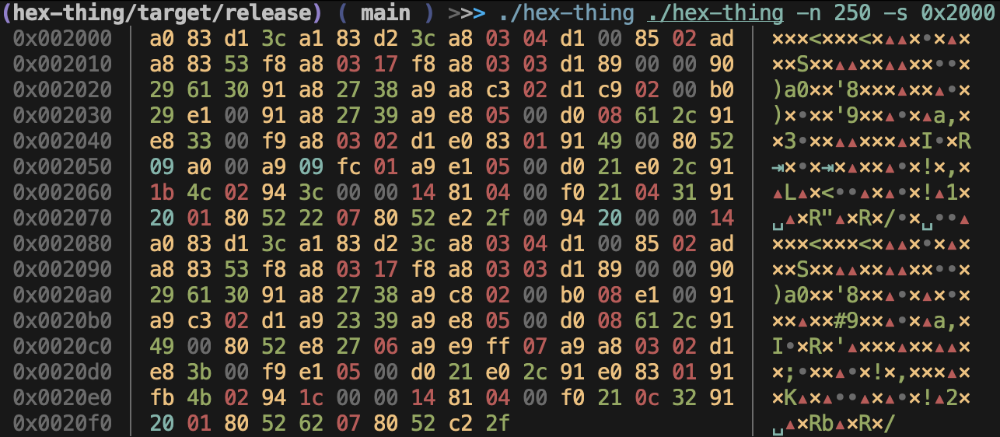

# hex-thing (name wip)



A hexdump tool written in Rust

### Usage

```shell
# clone the repo
git clone https://github.com/magokstad/hex-thing
# cd into the directory
cd hex-thing
# show how to use the cli tool
cargo run -- --help
# sample usage
cargo run -- ./binfile -b 0x0000-0x0FFF
```
